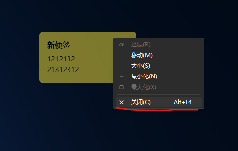

# 这是一个mac与windows可用的桌面便利贴的项目

## win与mac设计理念相同，打开软件后就是进入设置页面，设置页面可以添加、删除、修改便签，

## 便签可以设置标题、内容、颜色、字体、大小、位置等。

## 设置完成后勾选保存，便签就会显示在桌面。

## 便签可以设置为固定位置，也可以设置为手动调整位置。

## 桌面上的便签可以拖动，也可以点击进入编辑页面。

## 编辑页面可以修改标题、内容、颜色、字体、大小、位置等。

## 桌面上的便签可以点击进入编辑页面，也可以点击删除。

## 删除后，便签就会从桌面上消失。

## 桌面上的便签可以点击进入编辑页面，也可以点击保存。

## 保存后，便签就会更新。

## 桌面上的便签可以点击进入编辑页面，也可以点击删除。

## 删除后，便签就会从桌面上消失。

## 桌面上的便签可以点击进入编辑页面，也可以调整便签在桌面的透明度，防止遮挡桌面。

# version=1.0.0

## 目前已知问题

- 1.在未勾选固定位置的情况下，变迁在桌面不可拖动。
- 2.在未勾选固定位置的情况下，无法手动调整位置。
- 3.多次改变高度宽度后会留下重影。
- 4.没有取消显示在桌面的功能，导致删除便签后无法从桌面上消失。

# version=1.0.1

## 目前已知问题

- 1.鼠标右键标签点击关闭后，再进设置显示到桌面便签也不会出现

- 2.便签高度宽度设置取消，改成手动拉伸，让后固定位置选项取消，改到标签左上角加一个锁的标志用来固定位置
- 3.标签可拖动位置不明显，建议改为双重毛玻璃效果的标签，增加可识别性。可拖动区域颜色更深。
- 4.增加文字颜色设置。
- 5.增加设置：标签显示在所有应用之上还是只显示在桌面之上。
- 6.每次点击显示到桌面都会导致标签回归原始位置。位置不应该改变。
